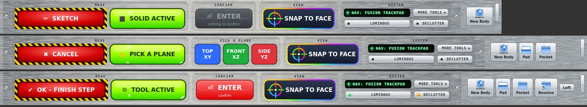

# SimpleCAD

**Source-available · Non-commercial** · Licensed under the [PolyForm Noncommercial License 1.0.0](LICENSE.md) · Copyright Matthew Armstrong · **No warranty, no liability: use at your own risk.** Free for personal, hobby, study and other non-commercial use; commercial use needs my separate permission. Not legal advice. See [THIRD_PARTY.md](THIRD_PARTY.md).



> The images here are renders from a simulated FreeCAD/Qt test harness, not photos of a live FreeCAD window.


A decluttered, Fusion 360-style workbench for FreeCAD (0.21 and 1.x). FreeCAD is powerful, but its screen is full of tools most people never touch. SimpleCAD hides them (nothing is removed) and puts the sketch → solid workflow front and centre.

## Features

- **Brushed-aluminium instrument panel**: the deck is a screwed-on brushed-metal plate with engraved, recessed modules (MODE · CONFIRM · VIEW · SYSTEM), machined keys with indicator LEDs and a green phosphor readout; SimpleCAD's tool rows get the same metal and keys. The grain is a seamless generated tile (`tools/make_brushed_alu.py`), so it's all offline. Turn the tool-row styling off with `ALU_TOOLBARS = False`.
- **The big red button** (in caution tape, shortcut **Ctrl+Enter**) does the next obvious thing:
  - **✏ SKETCH**: sketch on the selected face, or edit the selected sketch. With nothing selected, the three planes appear in the 3D view: click one, or press the big **TOP / FRONT / SIDE** buttons. No side-panel list to hunt through.
  - **✔ FINISH SKETCH**: close the sketch and leave it selected, so Extrude / Revolve / Loft is one click.
  - **✔ OK – FINISH STEP**: when a tool like Pad or Fillet is open, press its OK button.
- **Acid-green ACTIVE badge** with rising bubbles shows whether you're in SKETCH, SOLID or TOOL mode.
- **🎯 SNAP TO FACE**: look straight at the selected face (or the sketch you're in) and zoom to it.
- **⏎ ENTER button**: pulses red whenever a tool (Pad, Pocket, Fillet...) is open and ready to confirm; click it, or just press Enter on the keyboard. (Enter is left alone in sketch mode, where it confirms typed dimensions.)
- **Only the everyday tools**, and the toolbar swaps automatically between sketch tools and solid tools. Optional auto-extrude after finishing a sketch.
- **⋯ More tools**: every Part Design / Sketcher command, plus "Show all hidden toolbars" and a jump to the full Part Design workbench.
- **Stays put**: FreeCAD 1.x jumps to the Sketcher workbench when you open a sketch, and to Part Design whenever a Pad/Pocket/Fillet... dialog opens. SimpleCAD hops straight back without resetting anything (Declutter, deck and buttons stay as they were), and steps aside if FreeCAD ever keeps fighting it.
- **Tidy panels**: model tree, task panel, report view and Python console become tabs on the left, and the Tasks tab comes forward when a dialog opens.
- **🧭 Navigation readout** (the green phosphor display) cycles navigation styles (all orbit around the centre of the screen unless noted):
  - *Fusion Trackpad*: two-finger swipe pans, Shift or Option + two-finger swipe orbits, pinch zooms, two-finger double-tap fits everything; two-finger click-drag also orbits.
  - *TinkerCAD*: right-drag (two-finger click-drag) orbits, middle-drag pans, wheel zooms.
  - *FreeCAD Touchpad*: FreeCAD's own touchpad style.
  - *Fusion Mouse* and *Cursor Mouse* (orbit around what's under the mouse) need a mouse with a middle button, so on a Mac the button skips them; they're still in **More tools → 🧭 Navigation**.
  - Reverse trackpad directions or restore FreeCAD's original navigation from the same menu.
- **🌀 Rainbow swirl**: the selected face gets a smooth, see-through rainbow spiral so you can always see what's active (opacity: `SWIRL_OPACITY`). It animates gently (10 fps) and freezes to a static swirl by itself if the PC struggles; toggle it or make it static in **More tools → 🎨 Look**.
- **🌈 Rainbow faces**: every face gets its own bright, see-through colour, updated automatically after each Pad/Pocket (toggle in **More tools → 🎨 Look**; transparency and colour strength at the top of `SimpleCADDeck.py`).
- **Looks**: solids go even more see-through while you sketch. **🌙 Luminous** (high contrast: near-black background, glowing cyan solids, neon selection) or **☀ Clean** (light, soft blue-grey). Originals are backed up; **More tools → 🎨 Look → Restore** puts them back.
- **DECLUTTER key** (amber LED when on): hides every remaining toolbar, panel and the status bar (never the workbench switcher). Press again to undo. Nothing it hides is remembered by FreeCAD, so a restart, with or without SimpleCAD, always brings everything back.
- **Opens in SimpleCAD**: FreeCAD starts in SimpleCAD, and a new Part Design document (e.g. the Start page's *Parametric Body*) opens in SimpleCAD too. Turn off with **More tools → Start FreeCAD in SimpleCAD** (your previous start workbench comes back). The **LUMINOUS key** (green LED) switches the high-contrast 3D view.

## Install

**Manual:** copy this folder (the one containing `InitGui.py`) into FreeCAD's `Mod` folder as `SimpleCAD`, restart FreeCAD and pick **SimpleCAD** from the workbench list.

The easiest way to find the Mod folder is FreeCAD's Python console (**View → Panels → Python console**):

```python
import os; p = os.path.join(App.getUserAppDataDir(), "Mod"); os.makedirs(p, exist_ok=True); print(p)
```

Typical locations:

| OS | Mod folder |
|---|---|
| Linux | `~/.local/share/FreeCAD/Mod/` (Flatpak: `~/.var/app/org.freecad.FreeCAD/data/FreeCAD/Mod/`) |
| macOS | `~/Library/Application Support/FreeCAD/Mod/` (1.1+: `…/FreeCAD/v1-1/Mod/`) |
| Windows | `%APPDATA%\FreeCAD\Mod\` |

**Git:** from inside the Mod folder run `git clone https://github.com/The-Dorkknight/simplecad SimpleCAD`.

**Addon Manager:** ⚙ Preferences → Custom repositories → add `https://github.com/The-Dorkknight/simplecad` (branch `main`).

> Close FreeCAD **before** copying files into `Mod`, then restart. Copying while it runs can leave a half-loaded workbench.

## Customise

Everything tweakable is at the top of `SimpleCADDeck.py`: which tools appear, icon size, colours, themes, navigation presets, trackpad speeds and the bubble animation.

## Step by step

1. Start FreeCAD and pick **SimpleCAD** (it opens there by default).
2. Click the big red button (or **Ctrl+Enter**) with nothing selected, then click TOP / FRONT / SIDE in the 3D view.
3. Draw, then press the button again to finish the sketch; press **Extrude** (or let auto-extrude do it).
4. While a tool (Pad, Pocket, Fillet...) is open, press **Enter** or the ⏎ button.
5. **More tools** holds everything else, including **Show all hidden toolbars** and **About**.


## Troubleshooting

| Problem | Fix |
|---|---|
| SimpleCAD missing from the workbench list | The folder must be named `SimpleCAD` and contain `InitGui.py`; restart FreeCAD (closed while copying). Check **View → Panels → Report view** for errors. |
| Toolbars or panels missing | **More tools → Show all hidden toolbars**, or press DECLUTTER again. A restart always restores everything. |
| Navigation feels wrong | **More tools → Navigation** and pick another style, or restore FreeCAD's own. |
| Colours look odd | **More tools → Look → Restore**. |

## Known limitations

Developed against FreeCAD 1.1 on Linux and macOS and exercised against a simulated FreeCAD/Qt harness; other versions (0.21, Windows) are less tested. Fusion-style navigation needs a trackpad with gesture support. Part Design and Sketcher only.

More in [HOW_IT_WORKS.md](HOW_IT_WORKS.md).

## Contributing

See [CONTRIBUTING.md](CONTRIBUTING.md), [CHANGELOG.md](CHANGELOG.md) and [SECURITY.md](SECURITY.md).

## License

[PolyForm Noncommercial 1.0.0](LICENSE.md): you may use, modify and share it for non-commercial purposes (recipients must get the licence and the Required Notice); commercial use needs separate permission. Provided as-is, with no warranty or liability. Built with the help of Claude (Anthropic). Not affiliated with Autodesk or the FreeCAD project. This is source-available, not OSI open source.
